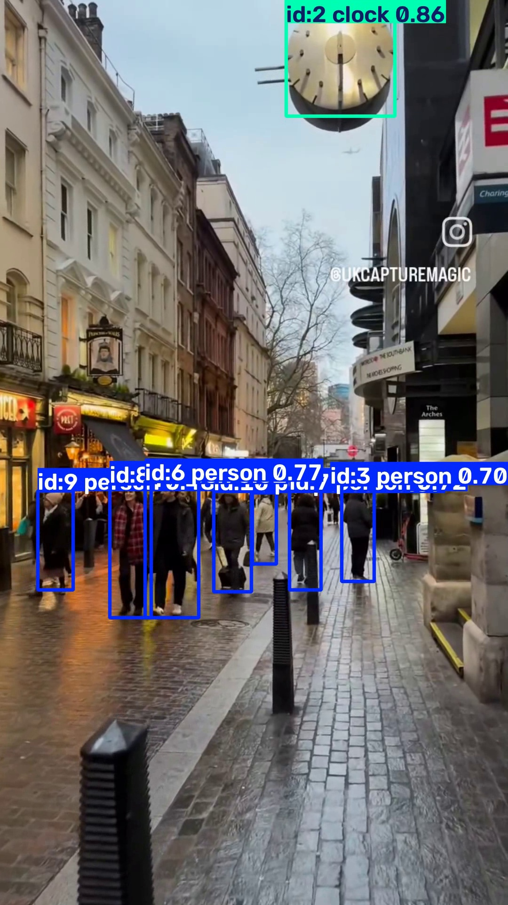
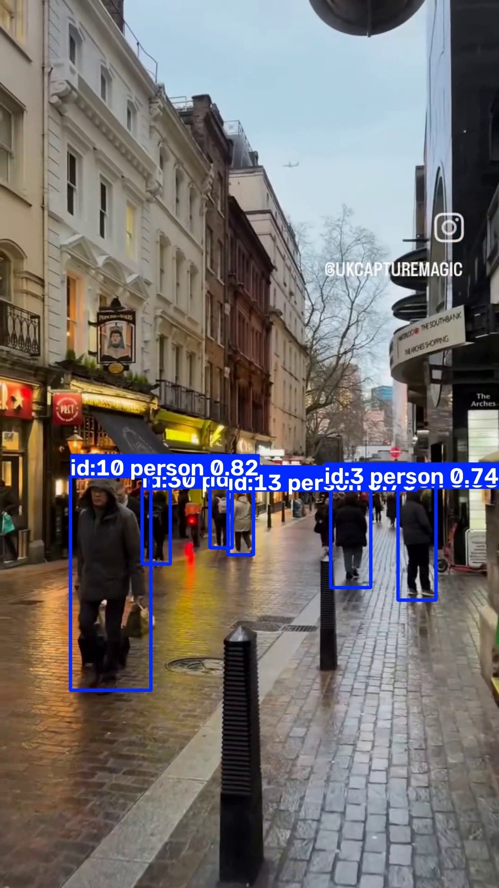
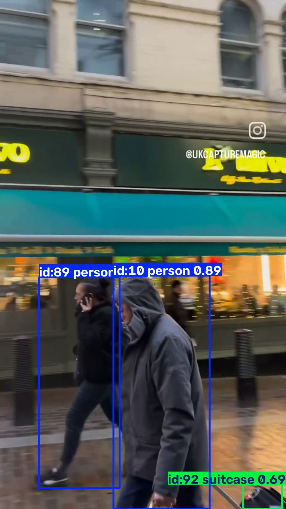

# Multi-Object Tracking System

## Problem Statement
Tracking multiple objects in a video is challenging because objects move, overlap, and may temporarily disappear. A computer vision system is required to detect objects and maintain a unique identity for each object across video frames.

## Objective
To develop a computer vision-based multi-object tracking system that detects and tracks multiple objects in a video using YOLO and ByteTrack.

## Dataset / Input
A video containing multiple moving objects is used as the input.

The project can be demonstrated using a user-provided video or a public multi-object tracking video dataset.

## Methodology
1. Read the input video frame by frame.
2. Detect objects using YOLO.
3. Apply ByteTrack for multi-object tracking.
4. Assign a unique ID to each detected object.
5. Draw bounding boxes and tracking IDs.
6. Generate the final tracked video.

## Tools and Libraries
- Python
- YOLO
- ByteTrack
- OpenCV
- NumPy
- Ultralytics

## Results

The system successfully detects and tracks multiple objects in the input video using YOLO and ByteTrack. Each detected object is assigned a tracking ID that is maintained across consecutive frames.

### Tracking Frame 1

### Tracking Frame 2

### Tracking Frame 3

### Output

The complete processed tracking video is generated as:

`results/tracked_output.mp4`
## Performance Evaluation
The system is evaluated qualitatively by observing:
- Object detection
- Persistence of object IDs
- Tracking during object movement
- Tracking during partial overlap

## Conclusion
The developed system demonstrates multi-object detection and tracking using YOLO and ByteTrack. It can maintain object identities across consecutive video frames and can be applied to surveillance, traffic monitoring, and smart automation applications.
