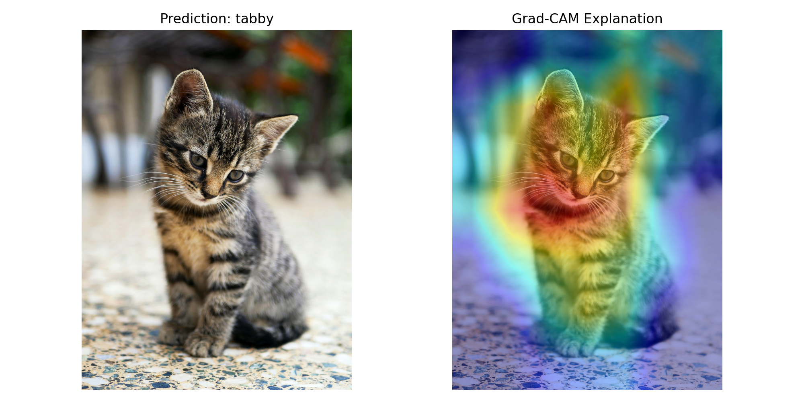
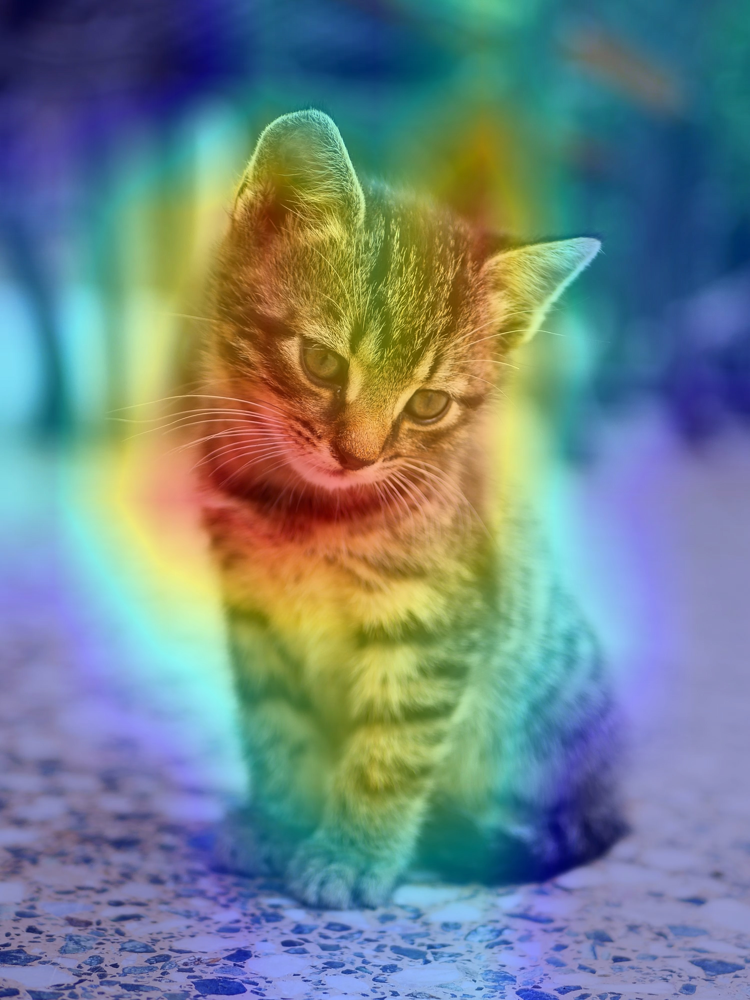

# Explainable AI for Object Recognition

## Problem Statement

Deep learning models can recognize objects accurately, but their decision-making process is often difficult to understand. An explainable computer vision system is required to show which regions of an image influenced the model's prediction.

## Objective

To develop an explainable object recognition system using a pretrained deep learning model and Grad-CAM to visualize the image regions that contribute to the model's prediction.

## Dataset / Input

A sample input image is used to demonstrate object recognition and explainability.

The system uses the ImageNet-pretrained MobileNetV2 model.

## Methodology

1. Input an image.
2. Resize the image to 224 × 224 pixels.
3. Preprocess the image for MobileNetV2.
4. Predict the object using the pretrained model.
5. Identify the important feature regions using Grad-CAM.
6. Generate a heatmap showing the regions influencing the prediction.
7. Overlay the heatmap on the original image.
8. Display and save the prediction and explanation.

## Tools and Libraries

- Python
- TensorFlow
- MobileNetV2
- Grad-CAM
- OpenCV
- NumPy
- Matplotlib

## Results

The system successfully recognized the input image as a **tabby cat** and generated a Grad-CAM visualization highlighting important regions of the image.

### Prediction and Explanation

### Grad-CAM Output

## Performance Evaluation

The system is evaluated based on:

- Correctness of the predicted object class
- Prediction confidence
- Quality of the Grad-CAM visualization
- Whether important object regions are highlighted

For the demonstrated input, the model predicted **tabby** and the Grad-CAM visualization highlighted the cat's important visual regions.

## Conclusion

The developed system demonstrates how Explainable AI can make object recognition models more interpretable. Grad-CAM provides a visual explanation by highlighting image regions that contribute to the model's prediction.
