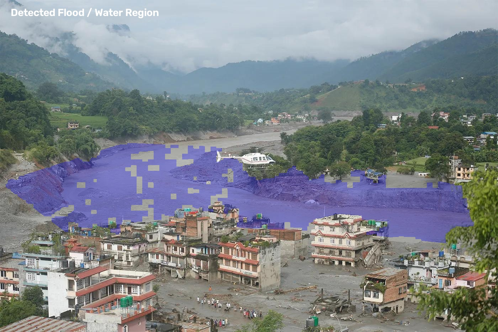

# Flood Detection from Images

## Problem Statement

Floods can cause severe damage to buildings, roads, and communities. Computer vision can help identify and visualize flooded regions from images for rapid assessment.

## Objective

To develop a computer vision-based flood detection system that identifies and highlights water/flooded regions in an image.

## Input

A flood-affected landscape image is used as the input.

## Methodology

1. Read the input flood image.
2. Convert the image from BGR to HSV color space.
3. Identify regions with color characteristics similar to muddy flood water.
4. Apply a region of interest to focus on the river and flooded area.
5. Remove small noisy regions using morphological operations.
6. Retain larger connected regions.
7. Generate a flood mask.
8. Overlay the detected region on the original image.

## Tools and Libraries

- Python
- OpenCV
- NumPy

## Results

The system successfully identifies and highlights the major flooded/water region in the input image.

### Flood Detection Result

### Flood Mask

## Performance Evaluation

The system is evaluated qualitatively based on:

- Detection of the major flooded/water region
- Reduction of false detections in surrounding areas
- Quality of the generated flood mask
- Visual clarity of the detected region

The demonstrated image shows the major river/flooded region highlighted while most surrounding buildings and vegetation remain unmarked.

## Conclusion

The developed computer vision system demonstrates flood-region detection using image processing and segmentation techniques. The generated mask and overlay provide a visual representation of the detected flooded area and can support rapid visual assessment of flood-affected scenes.
