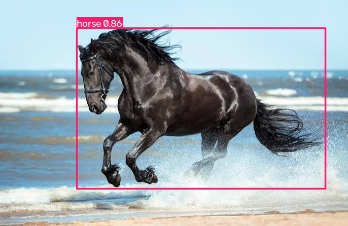

# Animal Detection for Smart Agriculture

## Problem Statement

Animals entering agricultural fields can damage crops. Manual monitoring is difficult, especially over large areas. A computer vision system can automatically detect animals from images and help farmers monitor their fields.

## Objective

To develop an animal detection system using a pretrained YOLO model that identifies animals in images and displays their location with bounding boxes and confidence scores.

## Dataset / Input

The project uses a user-provided animal image for demonstration.

The YOLO pretrained model is trained using the COCO dataset.

COCO Dataset:
https://cocodataset.org/

## Methodology

1. Input an image containing an animal.
2. Load the pretrained YOLO object detection model.
3. Process the image using YOLO.
4. Detect objects present in the image.
5. Identify animal classes.
6. Draw bounding boxes around detected animals.
7. Display the detected class and confidence score.
8. Save the annotated result.

## Tools and Libraries

- Python
- YOLO
- Ultralytics
- OpenCV
- NumPy

## Results

The system successfully detected the horse in the input image.

**Detected object:** Horse  
**Confidence:** 0.86 (86%)

### Detection Output

## Performance Evaluation

The model successfully localized the horse using a bounding box and produced a confidence score of 0.86.

This demonstrates that the pretrained YOLO model can identify animals from an input image.

The result is a qualitative demonstration using a single test image and should not be interpreted as an overall model accuracy measurement.

## Conclusion

The developed system demonstrates automated animal detection using computer vision. It can be extended for smart agriculture applications such as farm monitoring, animal intrusion detection, and automated alerts.
